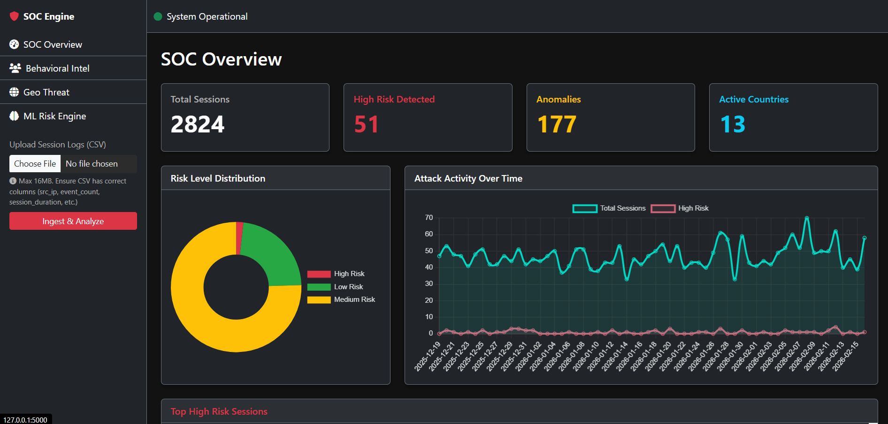
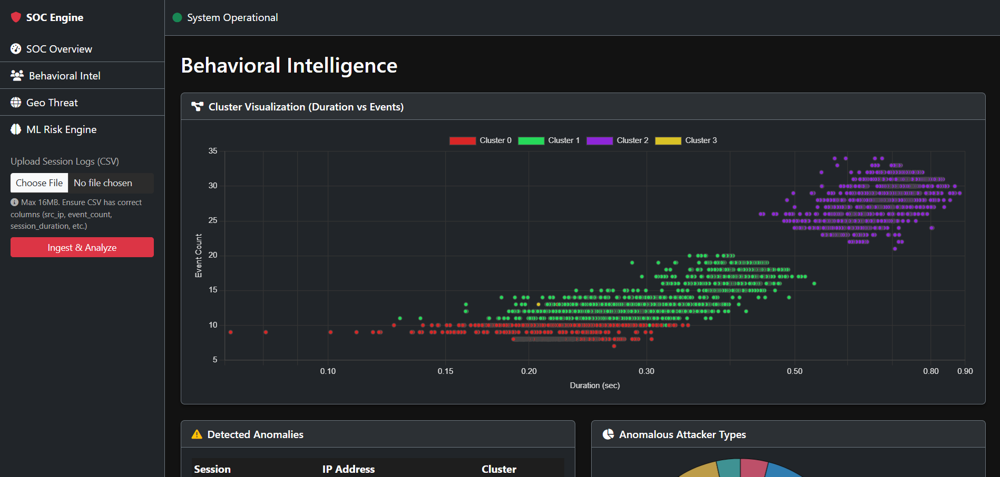
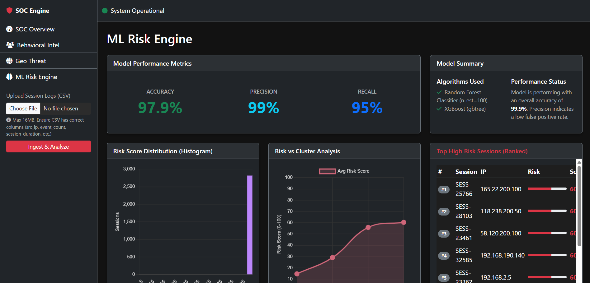
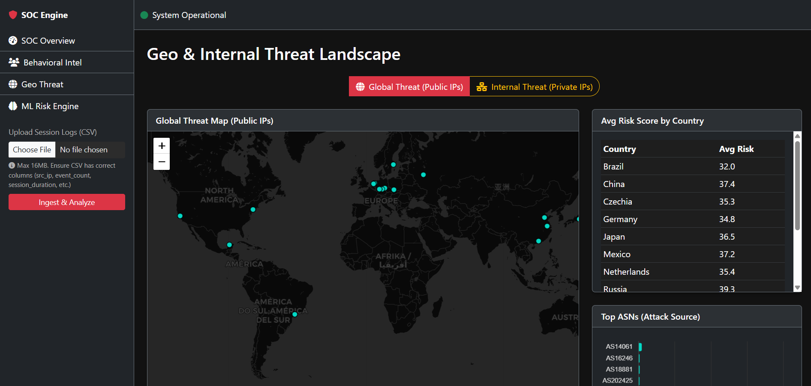

# 🛡️ AI Driven SSH Honeypot Threat Intelligence System

[](https://www.python.org/)
[](https://flask.palletsprojects.com/)
[](https://aisshhoneypot-80qj.onrender.com/)

An advanced, full-stack security analytics platform designed for SOC (Security Operations Center) analysts and researchers. This system transforms raw SSH honeypot logs into actionable intelligence using unsupervised clustering, anomaly detection, and supervised risk scoring.

---

## 🚀 Live Deployment
**Access the dashboard here:** [https://aisshhoneypot-80qj.onrender.com/](https://aisshhoneypot-80qj.onrender.com/)

---

## ✨ Key Features

### 1. 📊 SOC Overview (Executive Dashboard)
- **Real-time KPIs**: Monitor total sessions, high-risk threats, detected anomalies, and unique source countries.
- **Activity Monitoring**: Visualise attack trends over time with dual-axis line charts.
- **Top Risk Prioritization**: Instant visibility into the most dangerous active sessions.

### 2. 🧠 Behavioral Intelligence (Unsupervised ML)
- **Clustering**: Groups attackers by behavior using **MiniBatchKMeans**.
- **Anomaly Detection**: Identifies zero-day or outlier attacks using **IsolationForest**.
- **2D Projection**: High-dimensional behavioral data projected into 2D space via **PCA** for intuitive visualization.
- **Attacker Profiling**: Radar charts comparing behavioral clusters (Duration vs Commands vs Volume).

### 3. 🛡️ ML Risk Engine (Supervised ML)
- **Predictive Scoring**: Assigns a 0-100 risk score to every session using a **RandomForest** classifier.
- **Performance Transparency**: Real-time display of Model Accuracy, Precision, and Recall.
- **Attack Vector Analysis**: Detailed radar breakdown of session characteristics (Failed Logins, Command Diversity, etc.).

### 4. 🌍 Geo & Internal Threat Intelligence
- **Global Mapping**: Interactive world map using **Leaflet.js** to trace attack origins.
- **Internal Network Security**: Specialized views for private IP ranges, identifying lateral movement and internal risk hotspots.
- **ASN Analysis**: Categorize threats by ISP and Autonomous System for better attribution.

---

## 📸 Screenshots

| SOC Overview | Behavioral Intelligence |
| :---: | :---: |
|  |  |

| ML Risk Engine | Geo Threat Map |
| :---: | :---: |
|  |  |


---

## 🛠️ Tech Stack

### Backend & ML
- **Framework**: Flask (Python)
- **Data Science**: Pandas, NumPy
- **Machine Learning**: Scikit-learn (RandomForest, IsolationForest, MiniBatchKMeans, PCA, StandardScaler)
- **Geo-Location**: GeoIP2

### Frontend
- **UI Framework**: Bootstrap 5 (Dark SOC Theme)
- **Visualizations**: Chart.js (KPIs, Bar, Radar, Scatter, Doughnut)
- **Mapping**: Leaflet.js
- **Icons**: FontAwesome 6

### DevOps & Pipeline
- **Log Ingestion**: Memory-optimized streaming parser for Cowrie JSON logs.
- **Automation**: Systemd Timers for periodic batch processing.
- **Deployment**: Gunicorn (WSGI Server).

---

## ⚙️ Installation & Setup

### 1. Prerequisites
- Python 3.8 or higher
- [Cowrie Honeypot](https://github.com/cowrie/cowrie) (optional, for live data)

### 2. Clone the Repository
```bash
git clone https://github.com/ansarimohammad/ai-ssh-honeypot-threat-intel.git
cd ai-ssh-honeypot-threat-intel
```

### 3. Install Dependencies
```bash
pip install -r requirements.txt
```

### 4. Run the Dashboard
```bash
python app.py
```
Visit `http://localhost:5000` in your browser.

### 5. (Optional) Run the Data Pipeline
To process raw Cowrie logs and update the dashboard dataset:
```bash
python pipeline.py
```

---

## 🖥️ Server Deployment (Pipeline & Dashboard)

### 1. 📂 Pipeline Configuration (`pipeline.py`)
Before deploying the pipeline on your honeypot server, ensure the following paths are correctly set at the top of [pipeline.py](pipeline.py):
```python
COWRIE_LOG_PATH      = "/home/youruser/cowrie/var/log/cowrie/cowrie.json"
OUTPUT_CSV_PATH      = "/home/youruser/ai-ssh-honeypot/data/attacks.csv"
DASHBOARD_UPLOAD_URL = "https://your-dashboard-url.com/upload"
```

### 2. ⚙️ Automated Execution (Systemd)
To run the pipeline automatically every 10 minutes on your Linux server:

1. **Copy the service files:**
   ```bash
   sudo cp cowrie-pipeline.service /etc/systemd/system/
   sudo cp cowrie-pipeline.timer /etc/systemd/system/
   ```

2. **Update the Service File:**
   Edit `/etc/systemd/system/cowrie-pipeline.service` to match your server's user and paths:
   - `User=youruser`
   - `Group=youruser`
   - `WorkingDirectory=/path/to/ai-ssh-honeypot`
   - `ExecStart=/path/to/venv/bin/python3 pipeline.py`

3. **Enable and Start:**
   ```bash
   sudo systemctl daemon-reload
   sudo systemctl enable cowrie-pipeline.timer
   sudo systemctl start cowrie-pipeline.timer
   ```

4. **Monitor Status:**
   ```bash
   # Check if the timer is active
   systemctl list-timers --all | grep cowrie-pipeline
   
   # View live pipeline logs
   journalctl -u cowrie-pipeline -f
   ```

---

## 📂 Project Structure
- `app.py`: Main Flask application and API endpoints.
- `pipeline.py`: Incremental ETL & ML pipeline for log processing.
- `static/`: Frontend assets (JavaScript modules, CSS, custom icons).
- `templates/`: Jinja2 HTML templates for each dashboard view.
- `data/`: Directory for the processed `final_dashboard_dataset.csv`.

